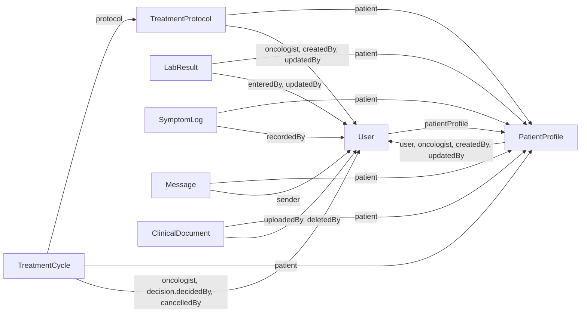

# Onco+Log

Onco+Log is a full-stack cancer treatment coordination portal for patients, oncologists, and laboratory staff. It brings patient profiles, treatment protocols and cycles, blood-work results, symptom tracking, clinical documents, and care-team messaging into one role-based application.

## Main Features

- Role-specific portals for patients, oncologists, and lab staff.
- Oncologist patient management, including invitation-based patient onboarding, medical profiles, allergies, diagnoses, and account deactivation.
- Treatment protocol and medication-plan management with chemotherapy, radiation, surgery, and supportive-treatment data.
- Treatment-cycle roadmaps with status tracking, bulk schedule editing, approval, and postponement.
- Blood-work entry, editing, deletion, history, and trend visualization.
- Patient symptom-journal entries with severity ratings and notes.
- Direct patient–oncologist messaging with unread counts, read status, editing, and deletion.
- Clinical-document upload and management through Cloudinary for PDF, DOC, DOCX, JPG, and PNG files up to 10 MB.
- Email/password authentication and Google sign-in.
- API input validation, role-based authorization, patient-level access checks, rate limiting, CORS, and security headers.

## Tech Stack

### Client

- React 18.3.1
- TypeScript 5.9
- Vite 6.4.3
- React Router 7.18
- Redux Toolkit 2.12 and React Redux
- Axios 1.18
- Tailwind CSS 4.1
- Lucide React
- Google OAuth React integration

### Server

- Node.js 24.x
- Express 5.2
- MongoDB with Mongoose 9.6
- JSON Web Tokens and bcrypt
- Joi request validation
- Google Auth Library
- Cloudinary and Multer
- Helmet, CORS, and Express Rate Limit

## Architecture and Folder Structure

Onco+Log uses a client–server architecture. The React single-page application calls a REST API over Axios. The Express API applies validation, authentication, role and patient-level authorization, then persists data in MongoDB through Mongoose models. Clinical-document files are stored in Cloudinary, while their metadata is stored in MongoDB.

```text
.
├── client/
│   ├── src/
│   │   ├── components/       # Shared UI and feature components
│   │   ├── constants/        # Shared client constants
│   │   ├── context/          # Authentication context
│   │   ├── pages/            # Auth, patient, oncologist, and lab-staff pages
│   │   ├── services/         # Axios client and API service modules
│   │   ├── store/            # Redux store and patient state
│   │   ├── styles/           # Global, theme, font, and Tailwind styles
│   │   ├── types/            # TypeScript domain and API types
│   │   ├── utils/            # Display, date, medication, and error helpers
│   │   ├── App.tsx           # Client routes and role-protected pages
│   │   └── main.tsx          # Application providers and entry point
│   ├── vercel.json           # SPA rewrite configuration
│   └── vite.config.ts        # Vite, React, Tailwind, and path-alias config
├── server/
│   ├── config/               # MongoDB and Cloudinary configuration
│   ├── controllers/          # API request handlers and business rules
│   ├── middleware/           # Auth, roles, validation, uploads, and errors
│   ├── models/               # Mongoose data models
│   ├── routes/               # Express REST routes
│   ├── utils/                # Validators, authorization, seed, and helpers
│   ├── app.js                # Express middleware and route registration
│   └── server.js             # Database connection and HTTP server startup
└── README.md
```

## MongoDB Schema and Collection Relationships




| Model | Default collection | References and embedded data |
| --- | --- | --- |
| `User` | `users` | Optionally references the user's `PatientProfile`. Stores the authentication method, role (`patient`, `oncologist`, or `lab_staff`), and active state. Passwords are hashed by a pre-save hook and excluded from queries by default. |
| `PatientProfile` | `patientprofiles` | Optionally links back to the registered patient `User`; requires an assigned oncologist and creator `User`, and can record an updater. Embeds allergy records. Email and national ID are unique. |
| `TreatmentProtocol` | `treatmentprotocols` | Belongs to a `PatientProfile` and an oncologist `User`, with creator and optional updater references. Embeds treatment-type plans and detailed medication records. |
| `TreatmentCycle` | `treatmentcycles` | Belongs to a `TreatmentProtocol`, `PatientProfile`, and oncologist `User`. Embeds its approval decision, whose optional `decidedBy` field references a `User`; `cancelledBy` also optionally references a user. |
| `LabResult` | `labresults` | Belongs to a `PatientProfile`; `enteredBy` requires a lab-staff `User`, while `updatedBy` is optional. Stores the dated blood-work measurements and notes. |
| `SymptomLog` | `symptomlogs` | Belongs to a `PatientProfile` and requires the recording `User`. Embeds one or more symptom items with a type, severity from 1–10, and optional custom label. |
| `Message` | `messages` | Belongs to a `PatientProfile` conversation and references its sender `User`. Stores the sender role, text, and separate patient/oncologist read flags. |
| `ClinicalDocument` | `clinicaldocuments` | Belongs to a `PatientProfile`; references the uploading `User` and, when deleted, an optional deleting `User`. MongoDB stores file metadata and the Cloudinary identifiers/URL rather than the file itself. |

The patient-account link is bidirectional: `User.patientProfile` points to the clinical profile, and `PatientProfile.user` is populated after invitation-based registration. Both fields are optional at schema level so an oncologist can create a profile in the `waiting_for_registration` state before a patient account exists.

Most patient-owned collections use `isActive` for application-level soft deletion. `ClinicalDocument` additionally records `deletedAt` and `deletedBy`; treatment cycles retain cancellation metadata. Every model enables Mongoose timestamps, adding `createdAt` and `updatedAt`.

Indexes support the main access patterns: protocols by patient and active state; cycles by patient/date and protocol/cycle number; labs by patient/test date; symptoms by patient/log date and recorder; messages by patient/date and sender; and documents by patient/date and uploader.

## Local Setup

### Prerequisites

- Node.js 24.x
- npm
- A MongoDB database
- A Cloudinary account to use clinical-document features
- A Google OAuth web client to use Google sign-in

### 1. Clone the repository

```bash
git clone https://github.com/linoy-1234/adv-full-stack-project.git
cd adv-full-stack-project
```

### 2. Install server dependencies

```bash
cd server
npm install
```

### 3. Configure the server environment

Create `server/.env` using the variables in the [Environment Variables](#environment-variables) section.

### 4. Install client dependencies

From the project root:

```bash
cd client
npm install
```

Copy `client/.env.example` to `client/.env`, then replace any placeholder values needed for your environment.

### 5. Optionally seed local data

From `server/`:

```bash
npm run seed
```

The seed script creates an oncologist, a lab-staff user, and an unlinked demo patient profile. It first removes existing records that use the same seed email addresses, so it should only be run against a development database where that replacement is acceptable.

## Environment Variables

Do not commit `.env` files or real credentials. The repository ignores `.env` and `.env.local` files.

### Server (`server/.env`)

| Variable | Required | Purpose |
| --- | --- | --- |
| `MONGO_URI` | Yes | MongoDB connection string used when the server starts. |
| `JWT_SECRET` | Yes | Secret used to sign and verify bearer tokens. Use a long, random value. |
| `JWT_EXPIRES_IN` | No | JWT lifetime; defaults to `7d`. |
| `PORT` | No | API port; defaults to `5000`. |
| `CLIENT_URL` | No | Allowed CORS origin; defaults to `http://localhost:5173`. |
| `GOOGLE_CLIENT_ID` | For Google sign-in | Google OAuth web client ID used to verify ID tokens. |
| `CLOUDINARY_CLOUD_NAME` | For document features | Cloudinary cloud name. |
| `CLOUDINARY_API_KEY` | For document features | Cloudinary API key. |
| `CLOUDINARY_API_SECRET` | For document features | Cloudinary API secret. |
| `NODE_ENV` | No | Set to `production` to suppress error stack details in API responses. |

Example with placeholders:

```dotenv
MONGO_URI=<your-mongodb-connection-string>
JWT_SECRET=<your-long-random-jwt-secret>
JWT_EXPIRES_IN=7d
PORT=5000
CLIENT_URL=http://localhost:5173
GOOGLE_CLIENT_ID=<your-google-oauth-client-id>
CLOUDINARY_CLOUD_NAME=<your-cloudinary-cloud-name>
CLOUDINARY_API_KEY=<your-cloudinary-api-key>
CLOUDINARY_API_SECRET=<your-cloudinary-api-secret>
NODE_ENV=development
```

### Client (`client/.env`)

| Variable | Required | Purpose |
| --- | --- | --- |
| `VITE_API_URL` | No | REST API base URL; defaults to `http://localhost:5000/api`. |
| `VITE_GOOGLE_CLIENT_ID` | For Google sign-in | Google OAuth web client ID supplied to the client provider. |

```dotenv
VITE_API_URL=http://localhost:5000/api
VITE_GOOGLE_CLIENT_ID=<your-google-oauth-client-id>
```

The client and server Google client IDs must refer to the same OAuth web client.

## Running the Application

### Server

From `server/`, run the development server with automatic restart:

```bash
npm run dev
```

For the production-style command:

```bash
npm start
```

The API is available at `http://localhost:5000/api` by default. Check it with `GET http://localhost:5000/api/health`.

### Client

In a separate terminal, from `client/`:

```bash
npm run dev
```

Vite serves the client at `http://localhost:5173` by default.

Additional client commands:

```bash
npm run typecheck
npm run build
npm run preview
```

## Key API Endpoints

All paths below are relative to the `/api` base path. Protected endpoints expect `Authorization: Bearer <token>`.

| Method | Endpoint | Access and purpose |
| --- | --- | --- |
| `GET` | `/health` | Public API health check. |
| `POST` | `/auth/register` | Public patient registration for an existing, unlinked patient profile with the same email. |
| `POST` | `/auth/login` | Public email/password login. |
| `POST` | `/auth/google` | Public Google sign-in or activation of an invited patient account. |
| `GET` | `/auth/me` | Return the authenticated user and linked patient profile. |
| `GET`, `POST` | `/patients` | Oncologist or lab staff list patients; oncologists create patient profiles. |
| `GET`, `PUT`, `DELETE` | `/patients/:id` | Authorized patient-profile access; oncologists update or deactivate profiles. |
| `GET`, `POST` | `/treatments/patients/:patientId/protocol` | Read a patient's protocol or create one as the assigned oncologist. |
| `GET` | `/treatments/my/protocol` | Patient reads their own protocol and cycles. |
| `PUT`, `DELETE` | `/treatments/protocols/:protocolId` | Oncologist updates or deactivates a protocol. |
| `GET`, `POST` | `/treatments/protocols/:protocolId/cycles` | Read protocol cycles or create a cycle as an oncologist. |
| `PUT` | `/treatments/protocols/:protocolId/cycles/bulk` | Oncologist updates multiple cycles and removes selected cycles. |
| `PUT`, `DELETE` | `/treatments/cycles/:cycleId` | Oncologist updates or deactivates a cycle. |
| `PATCH` | `/treatments/cycles/:cycleId/approve` | Oncologist approves a treatment cycle. |
| `PATCH` | `/treatments/cycles/:cycleId/delay` | Oncologist postpones a cycle to new dates. |
| `GET` | `/labs/my` | Patient reads their own lab results. |
| `GET`, `POST` | `/labs/patients/:patientId` | Authorized roles read results; lab staff create results. |
| `GET`, `PUT`, `DELETE` | `/labs/:labResultId` | Authorized result lookup; lab staff update or deactivate results. |
| `GET`, `POST` | `/symptoms/my` | Patient reads or creates their own symptom logs. |
| `GET` | `/symptoms/patients/:patientId` | Patient or assigned oncologist reads patient symptom logs. |
| `GET`, `PUT`, `DELETE` | `/symptoms/:symptomLogId` | Authorized lookup; the owning patient updates or deactivates a log. |
| `GET`, `POST` | `/messages/patients/:patientId` | Patient and assigned oncologist read or send messages. |
| `GET` | `/messages/my` | Patient reads their own conversation. |
| `GET` | `/messages/my/unread-count` | Patient unread-message count. |
| `GET` | `/messages/unread-counts` | Oncologist unread counts grouped by patient. |
| `PATCH` | `/messages/patients/:patientId/mark-all-read` | Mark the authenticated participant's conversation messages as read. |
| `PATCH`, `DELETE` | `/messages/:messageId/read`, `/messages/:messageId/edit`, `/messages/:messageId` | Read, edit, or deactivate an authorized message. |
| `GET`, `POST` | `/documents/patients/:patientId` | Patient or assigned oncologist lists documents; oncologists upload them. |
| `PUT`, `DELETE` | `/documents/:documentId` | Oncologist updates metadata or soft-deletes a document. |
| `GET` | `/documents/:documentId/url` | Patient or assigned oncologist obtains the document URL. |

## Authentication and User Roles

The API issues JWTs after email/password login, Google sign-in, or successful patient registration. The client stores the token and user record in `localStorage`, adds the token to Axios requests, and restores the session through `/auth/me`. Passwords are hashed with bcrypt before storage.

Patient self-registration is invitation-based: an oncologist must first create a patient profile, and the registering email must match that unlinked profile. The public registration flow always creates a `patient` account. Oncologist and lab-staff accounts are not created by the public registration endpoint.

| Role | Capabilities |
| --- | --- |
| `patient` | View their profile, treatment roadmap, medication plan, lab history, and clinical documents; manage their symptom journal; message their assigned oncologist. |
| `oncologist` | Manage assigned patient profiles, protocols, medications, and cycles; review labs and symptoms; approve or postpone cycles; manage clinical documents; message assigned patients. |
| `lab_staff` | List active patients and create, update, or deactivate blood-work results; read the patient and treatment information needed for lab workflows. |

Role checks are supplemented by patient-level ownership checks. Oncologists are limited to their assigned patients for patient-specific clinical data, patients are limited to their own linked profile, and lab staff do not receive access to messages, symptoms, or clinical documents.


## Team

| Member | Role |
| --- | --- |
| Linoy Cohen | Full-Stack Developer |

## Live Deployment

- Frontend (Vercel): [https://onco-log-app.vercel.app](https://onco-log-app.vercel.app)
- Backend (Render): [https://oncolog-server-8udj.onrender.com](https://oncolog-server-8udj.onrender.com)
- API health check: [https://oncolog-server-8udj.onrender.com/api/health](https://oncolog-server-8udj.onrender.com/api/health)
